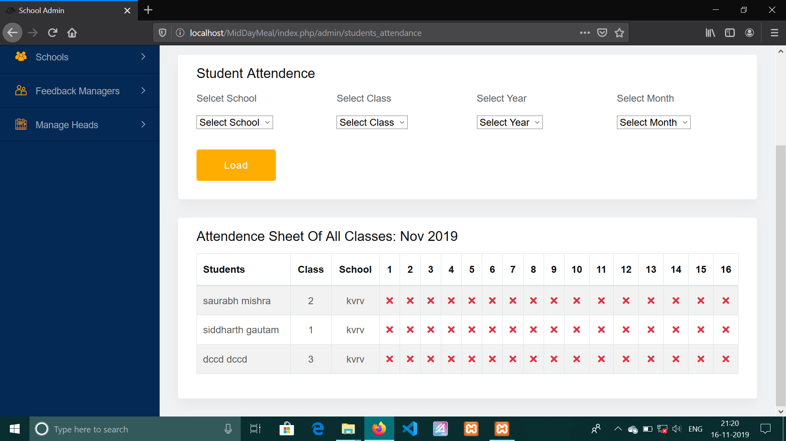
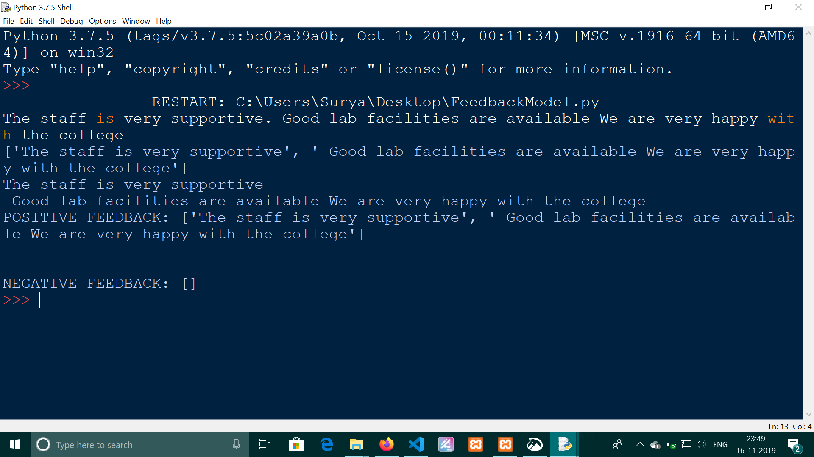
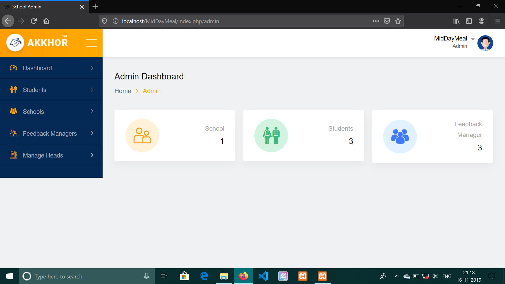

# extensiveClassroomMonitoring
 A Monitoring System which helps to have a proper assistant on Government Primary Schools. Machine Learning Algorithms and Web Technologies like HTML5, CSS3,PHP and JavaScript are used to develop this system.
 Mid day meal scheme for government primary schools under SARVA SIKSHA ABHIYAN.

### Your can visit other projects and repository here 
https://epsilondev98.github.io/portfolioEpsilon/
### or
https://github.com/epsilonDev98/

### ***project preview***

### 1

### 2

### 3

### 4

